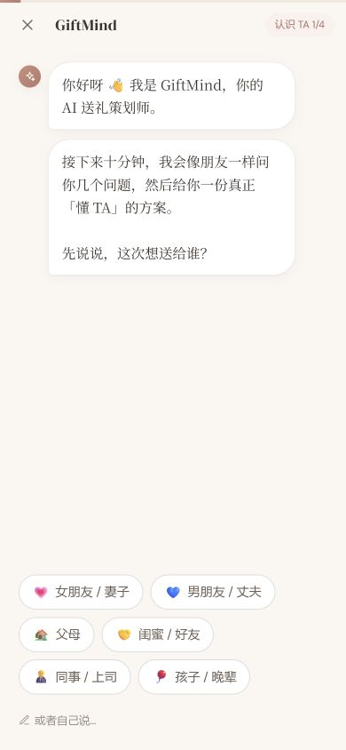
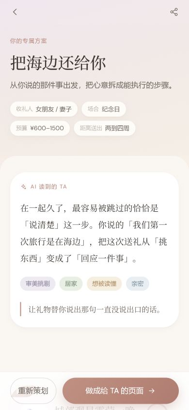
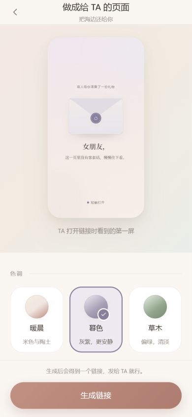
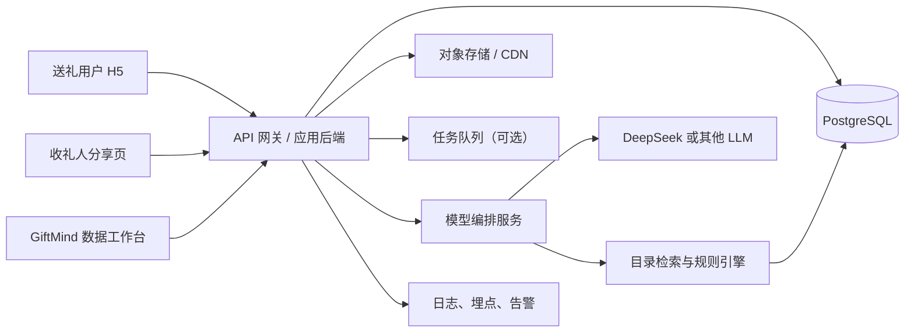
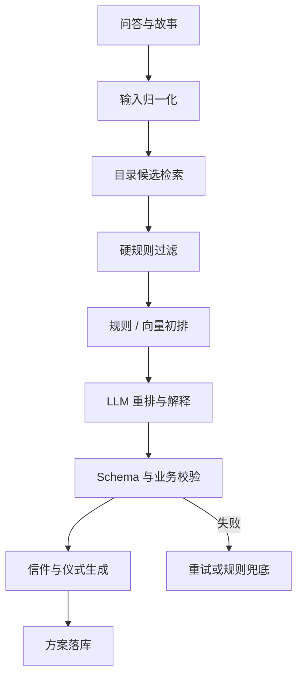

# GiftMind H5 全功能实现审计与建设方案

> 文档状态：审核稿
> 审计日期：2026-07-31
> 审计对象：`giftmind-h5` 当前静态演示版
> 目标：明确“把所有页面变成真实可用产品”所需的前端、后端、数据、AI、分享、运营和上线工作。

---

## 0. 结论先行

当前项目不是“缺几个接口”的半成品，而是一个**视觉与交互完成度较高、业务能力仍以 Mock 为主的产品原型**。

已经做好的部分：

- 首页、问答、生成过场、方案结果、信件、仪式、分享编辑、收礼页、历史列表等主要页面已经存在；
- 移动端视觉语言统一，主流程可以完整演示；
- 前端已经预留 Mock / 真实 API 适配层；
- 礼物数据开始区分商品与活动，并预留报价、变体、来源和核验状态；
- 当前生产构建通过，101 条演示目录记录通过结构校验。

尚未真正实现的核心能力：

1. **真实 AI 策划服务**：现在的“AI”主要是本地规则、素材拼接和固定延迟。
2. **真实礼物数据库与检索**：101 条数据全部未核验，没有真实报价、图片、链接、库存或活动场次。
3. **可靠的推荐约束**：预算、对象、场合、禁忌、时效目前部分只是扣分，不是硬过滤。
4. **持久化后端**：草稿、方案、分享、历史都主要保存在当前浏览器的 `localStorage`。
5. **跨设备分享**：当前分享链接只在生成链接的同一浏览器里可读。
6. **收礼人回信闭环**：页面会显示“已送达”，但没有真正提交到服务端，也不会通知送礼人。
7. **用户身份与跨设备历史**：没有匿名服务端会话或账号体系，换手机后方案不可见。
8. **运营与质量体系**：没有埋点、模型评测、推荐解释追踪、内容审核、告警和后台运营闭环。

因此，建议把下一阶段定义为：

> **把静态原型升级为“匿名优先、目录约束、可跨设备分享”的真实 MVP。**

第一版不要先做复杂社交账号、自营支付、全网自动爬虫或微服务。先保证用户能稳定完成：

> 说清需求 → 得到可信方案 → 替换和修改 → 生成真实分享链接 → 对方打开并回信 → 自己以后还能找到方案。

---

## 1. 本次审计范围与证据边界

本次实际在 390 × 844 移动视口跑通了以下链路：

1. 首页进入策划；
2. 选择收礼对象、场合、时间、预算和性格；
3. 输入共同记忆；
4. 生成方案；
5. 查看推荐、信件和仪式；
6. 编辑分享页；
7. 生成并打开收礼人页面；
8. 查看回信入口；
9. 返回历史方案。

测试输入为：

- 收礼人：女朋友 / 妻子；
- 场合：纪念日；
- 距离送出：两到四周；
- 预算：¥600–1500；
- 性格：文艺 / 小众、温柔 / 居家；
- 共同记忆：第一次旅行在海边，最近在学陶艺，喜欢安静、有纪念感但不张扬的东西；
- 期望感受：被深深理解；
- 形式偏好：实物礼物、体验类。

代码审查覆盖了路由、对话剧本、API 适配器、请求封装、Pinia Store、分享页、目录模型和 Mock 推荐器。没有真实后端可供审计，因此有关服务端、跨设备、真实模型和真实商品可用性的判断，来自当前代码边界，而不是线上接口测试。

### 1.1 当前页面证据

#### 步骤 1：首页


优点：价值主张清楚，主操作突出，品牌气质稳定。
风险：页面承诺“AI 聊十分钟”和“专属方案”，正式上线后必须由真实对话与推荐质量支撑。

#### 步骤 2：结构化问答



优点：选项优先、输入负担低，符合移动端使用习惯。
风险：当前问题顺序主要由静态剧本决定，不是真正根据回答动态追问。

#### 步骤 3：输入关系故事


优点：这是推荐个性化最有价值的信息入口。
风险：这些内容可能涉及亲密关系和隐私，服务端需要明确保存期限、删除能力和日志脱敏。

#### 步骤 4：生成与结果



优点：结果不是简单商品列表，而是“洞察 + 礼物 + 信 + 仪式”，差异化很强。
风险：生成过程目前模拟阶段文案；结果的价格、可获得性和匹配度没有真实证据支撑。

#### 步骤 5：分享编辑



优点：主题、称呼、内容开关和签名都已经形成可用的编辑体验。
风险：生成出的链接目前只引用本机数据，不能视为真正分享成功。

#### 步骤 6：收礼人打开


优点：收礼人视角完整，没有后台工具感，情绪体验是当前项目最成熟的部分。
风险：回信目前只是本地 UI 状态，不会真正送给策划人。

#### 步骤 7：历史方案


优点：有搜索、删除和草稿续接意识。
风险：数据只在当前设备，清浏览器数据或换设备后全部丢失。

---

## 2. 当前“已完成”与“看起来完成”的区别

| 模块 | UI 状态 | 当前真实程度 | 要成为可上线功能还缺什么 |
| --- | --- | --- | --- |
| 首页 | 完整 | 真实静态页面 | 埋点、内容配置、SEO、渠道参数 |
| 对话问答 | 完整 | 静态流程 + 本地草稿 | 服务端会话、动态追问、恢复与冲突处理 |
| AI 追问 | 有入口 | Mock 回声 | 真实模型、多轮上下文、工具调用、超时与降级 |
| 方案生成 | 完整 | 本地确定性规则与文案素材 | 检索、硬过滤、模型编排、Schema 校验、落库 |
| 礼物推荐 | 完整 | 演示目录打分 | 已发布目录、真实报价/来源、库存/时效、合规校验 |
| 契合度 | 完整 | 相对分数映射 | 可解释评分、线上校准，或改成不误导的等级 |
| 换一批 | 可点击 | 本地重新抽取 | 服务端排除集、反馈原因、重复控制、配额与防抖 |
| 收藏 | 可点击 | Pinia 内存状态 | 服务端收藏、持久化、历史同步 |
| 信件重写 | 可点击 | 本地素材重组 | 真实模型、用户编辑、版本历史、敏感内容校验 |
| 仪式流程 | 完整 | 素材拼接 | 与礼物、时间、地点、活动预约联动 |
| 方案历史 | 完整 | `localStorage` | 数据库、匿名身份/账号、分页、删除与导出 |
| 分享编辑 | 完整 | 本地配置 | 服务端快照、公开 slug、撤销/过期、权限控制 |
| 分享打开 | 完整 | 同浏览器可读 | 跨设备 API、CDN/SSR、失效页、访问统计 |
| 收礼人回信 | 完整 | 只在页面显示成功 | 写入数据库、限流、查看入口、通知与删除 |
| 商品/活动数据 | 有 Schema | 101 条 Seed | 采集、审核、发布、报价、变体、图片和更新时间 |
| 登录 | 无 | 请求层只预留 token | 匿名身份优先；需要时再补手机号/微信绑定 |
| 支付/订阅 | 无 | 未实现 | 产品确认收费方式后再设计，不属于 MVP 阻塞项 |
| 运营后台 | 另有数据工具雏形 | 未与 H5 打通 | 发布流、质量看板、失效复核、推荐回溯 |

---

## 3. 当前最重要的产品与技术问题

### 3.1 当前阶段的优先级定义

当前仍处于本地原型验证阶段，没有真实用户，也暂时不以公开上线、跨设备访问和商业化为目标。因此，本章中的优先级按照下面的阶段目标重新定义：

> **当前 P0：先在本地把“挑选 → AI 理解 → 生成方案 → 人工调整 → 创建分享 → 收礼人展示”整条链路真正跑通。**

当前 P0 的判断标准不是“是否具备正式上线条件”，而是：

- AI 是否真的参与理解和生成，而不是继续使用固定 Mock 文案；
- 推荐结果是否来自现有礼物目录，并且基本符合对象、场合、预算和故事；
- 方案中的洞察、礼物理由、信件和仪式是否完整且可修改；
- 分享编辑和收礼人页面是否能使用同一份真实生成结果；
- 整条链路能否在本地稳定重复演示，失败时有明确提示和重试入口。

服务端持久化、跨设备分享、正式账号、真实供给核验等仍然重要，但在本地 AI 闭环验证完成前统一降为 P1。第 15 章保留的是未来正式上线时的完整优先级，本章描述的是**当前开发阶段的执行顺序**。

### P0-1：本地真实 AI 全链路

第一优先级是把现有页面从“固定流程 + Mock 生成器”升级成真实 AI 驱动的本地原型：

```text
问答输入
  → AI 提取人物、关系、场合、预算、时间、禁忌和共同记忆
  → 从本地礼物目录中检索候选
  → 规则过滤和排序
  → AI 从候选中选择并生成推荐理由
  → AI 生成关系洞察、信件和仪式流程
  → 用户审核、换礼物、换语气或重新生成
  → 创建本地分享数据
  → 收礼人页面完整展示同一份结果
```

当前阶段允许继续使用 `localStorage` 保存会话、方案和分享，也允许分享链接只在同一台本地环境中打开。重点是先证明产品体验和 AI 结果值得继续投入。

本地 AI 接入需要做到：

- DeepSeek API Key 从本地服务的 `.env` 读取，不进入前端代码；
- 模型名、base URL、超时和最大 token 可配置，不在页面逻辑中写死；
- 前端只访问本地 API，不能直接从浏览器调用 DeepSeek；
- AI 返回严格的结构化 JSON；
- 支持超时、非法 JSON、模型拒绝、余额不足和网络失败提示；
- AI 不可用时可以切回当前规则 Mock，方便对照和继续演示。

### P0-2：提示词拆分、优化和版本化

现在不应继续依赖一个 prompt 一次性生成所有内容。建议先在本地拆成五类提示词，并分别迭代：

1. **信息提取 Prompt**：把问答和故事整理成结构化人物画像，不推荐礼物；
2. **候选选择 Prompt**：只允许从本地候选 `catalogId` 中选择，不得发明目录外礼物；
3. **推荐解释 Prompt**：解释每件礼物为什么适合，并引用用户真实提供的细节；
4. **信件 Prompt**：根据关系、语气和共同记忆生成可编辑信件；
5. **仪式 Prompt**：结合准备时间、礼物类型和场合生成可执行步骤。

每个 Prompt 都需要：

- 独立的 system prompt 和输入模板；
- 明确的 JSON Schema；
- `promptVersion`；
- 3–5 个高质量 few-shot 示例；
- 禁止编造商品、价格、库存、链接和用户没有提供的经历；
- 输出长度、语气、敏感内容和重复表达约束；
- 对应的测试案例与结果记录。

本地调试页应能看到：

- 本次使用的模型和 Prompt 版本；
- 输入摘要；
- 目录候选 ID；
- AI 最终选择的 ID；
- 原始结构化输出；
- 校验失败原因、耗时和 token 用量。

这些调试信息只用于开发，不显示在正式 H5 页面。

### P0-3：目录约束推荐与结果质量

本次实测中，“纪念日送女朋友”得到：

- 城郊观星露营一晚：基本合理；
- 一次正经的全家福拍摄：说明中写“趁大家都还在”“上一张全家合影”，与当前关系和故事明显错位；
- 手作对戒：价格为 ¥1200–2800，而用户预算上限是 ¥1500。

原因不是单纯的文案问题，而是推荐器把收礼对象、场合和预算中的多项约束当作软扣分。本地 AI 版本也必须先分成两层：

1. **硬过滤**：对象不适配、价格超上限、时间来不及、禁忌命中、活动地区不可达、商品已下架时直接排除；
2. **软排序**：故事、性格、期望感受、风格和惊喜程度用于排序。

当前 101 条 Seed 数据虽然尚未核验真实供给，但已经足够用于本地推荐逻辑验证。现阶段应先做到：

- 过滤后再把候选交给模型；
- 模型只能返回候选中的 `catalogId`；
- 服务端根据 ID 回填名称、价格、类型等目录原始数据；
- 模型只负责选择、排序和生成理由；
- 商品与活动至少各有一套对应的解释和执行逻辑；
- 候选不足时明确提示用户补充信息或放宽条件；
- 生成结果再次经过预算、对象、场合、时间和禁忌校验；
- 校验不通过时自动修复一次，仍失败则使用规则结果兜底。

### P0-4：方案调整能力要贯穿 AI 闭环

“生成一次”不等于链路完成。当前本地版本至少需要让以下动作真正调用 AI 或推荐器，并把更新后的结果保存回同一份方案：

- 换一件礼物，而不只是整批随机替换；
- 告诉 AI“太贵、太普通、不适合、已经送过、时间来不及”；
- 重新生成推荐理由；
- 切换信件语气；
- 手动编辑信件内容；
- 重新生成仪式流程；
- 保留用户已经确认的礼物，只重做未确认部分；
- 分享页面始终读取修改后的最终版本。

建议把每次修改记录为一条本地版本，至少支持“撤销上一步”，避免 AI 重写后无法找回原结果。

### P0-5：建立本地 Prompt 评测与回归样例

提示词优化不能只靠打开页面凭感觉判断。当前阶段先建立 30–50 个本地案例即可，覆盖：

- 恋人、父母、朋友、同事和孩子；
- 生日、纪念日、道歉、毕业、节日和无明确场合；
- 不同预算和准备时间；
- 商品、活动和混合偏好；
- 明确禁忌；
- 有详细故事、只有一句描述、完全没有故事；
- 当前目录里确实没有合适礼物的情况。

每次改 Prompt 后自动输出对比报告，至少检查：

- 是否选择目录外 ID；
- 是否预算越界；
- 是否违反禁忌；
- 是否对象或场合错配；
- 推荐理由是否真正引用用户信息；
- 三件礼物是否重复；
- 信件是否编造经历；
- 仪式是否可执行；
- JSON 是否稳定通过校验。

### P0-6：本地分享展示链路完整可演示

现阶段不要求另一台真实手机通过公网打开，但需要在本地证明分享链路使用的不是另一套假数据：

- 分享编辑读取当前方案最终版本；
- 主题、称呼、问候语、签名和内容开关生效；
- 生成本地 `shareId`；
- 收礼人页面通过 `shareId` 读取对应方案快照；
- 礼物、信件和仪式与分享前确认的内容一致；
- 收礼人回信可以先保存在本地，并能在送礼人方案中看到；
- 删除或重做方案时，系统明确说明是否影响已有分享。

完成标准是：关闭页面后重新打开，本地方案和分享仍在；重新生成或修改后，分享展示的版本关系清楚且可验证。

### P1-1：当前礼物库只有“创意种子”，没有真实可交付供给

当前目录校验结果：

```text
总数：101
商品：83
活动：18
未核验：101
无真实报价：101
无图片：101
```

这些数据足够用于本地 AI 与推荐逻辑验证，但不适合对真实用户承诺“怎么买”“多少钱”“什么时候能拿到”。准备上线时，H5 只能读取数据工作台中处于 `published` 且通过质量门槛的记录。

### P1-2：服务端身份、数据库和跨设备持久化

当前草稿、方案和历史都只存在设备本地。本地 AI 闭环完成后，再建设“匿名优先”的服务端能力：

- 首次访问下发匿名用户 token；
- 会话、方案、分享写入服务端；
- 本地只做缓存和离线草稿；
- 后续用户愿意时，可把匿名数据绑定到手机号或微信。

### P1-3：真正的跨设备分享与回信

`mockAdapter.createShare()` 当前把分享配置写进 `gm_shares`，另一台手机没有这份 `localStorage`。准备邀请真实用户前，再升级为：

- 服务端生成不可猜测的 `shareSlug`；
- 保存方案的不可变分享快照；
- 收礼页通过公开只读 API 获取；
- 支持撤销、过期和内容更新策略；
- 回信写入服务端并关联分享；
- 送礼人可以查看回信。

### P1-4：当前“契合度 98%”容易造成虚假精确感

当前分数是规则得分映射到 60–98，并不是经过用户反馈校准的概率。MVP 建议两种方式择一：

- 改成“首选 / 很适合 / 可考虑”等等级；
- 保留分数，但在后台明确它是排序分，不在用户侧写“百分比可信度”。

### P1-5：动态分享卡片和微信传播能力缺失

当前使用 hash 路由，微信和搜索爬虫无法为每个分享生成独立标题、描述和缩略图。正式分享页需要服务端路由、SSR 或预渲染，并提供动态 Open Graph 图片。

---

## 4. 推荐的目标架构



### 4.1 建议技术选型

| 层 | MVP 建议 | 说明 |
| --- | --- | --- |
| H5 | 保留 Vue 3 + Vite + Pinia | 当前工程无需重写 |
| 后端 | FastAPI 或现有团队最熟悉的 Node 框架 | 单体服务即可，不要过早拆微服务 |
| 数据库 | PostgreSQL | 适合结构化关系、JSON 扩展、全文检索与后续向量能力 |
| 缓存/队列 | Redis 可选 | 生成任务、限流、短缓存；早期流量小可以后补 |
| 文件 | 腾讯云 COS + CDN | 商品图、分享 OG 图、导出文件 |
| AI | 服务端调用 DeepSeek | API Key 只放服务器 `.env`，不下发浏览器 |
| 部署 | Docker Compose 或 systemd + Nginx | 当前阶段够用 |
| 监控 | Sentry 类前端错误 + 服务端结构化日志 | 至少能定位生成失败和分享打不开 |

### 4.2 与数据工作台的关系

`giftmind-data-studio` 应当是礼物资料的**录入、AI 辅助、人工审核和发布后台**；H5 是面向用户的**推荐与分享前台**。

二者不要各存一套互相漂移的数据：

```text
采集/解析 → AI 预填 → 人工审核 → 发布 → H5 可检索
                                  ↓
                         失效复核 / 下架 / 更新
```

H5 只能推荐已经发布并满足质量门槛的目录记录；草稿、未核验抓取结果和失效报价不能进入公开推荐池。

---

## 5. 服务端需要建设的业务模块

### 5.1 会话与问答模块

需要保存：

- 匿名用户或登录用户；
- 一次策划会话；
- 每一题的结构化答案；
- 自由文本和多轮消息；
- 当前步骤、版本和状态；
- 创建、暂停、恢复、完成时间。

关键能力：

- 草稿自动保存；
- 断网重试和幂等写入；
- 用户回到上一题时保留版本；
- 对话剧本版本化，避免旧会话被新问题顺序破坏；
- AI 动态追问必须受最大轮数和可跳过规则约束。

### 5.2 目录与供给模块

目录要继续保持三层：

```text
gift_idea（礼物想法）
├── offers（真实平台、商家、门店、活动场次）
└── variants（颜色、尺寸、套餐、人数、场次）
```

还应增加：

- 发布状态：draft / review / published / archived；
- 数据来源与抓取时间；
- 人工核验人和核验时间；
- 图片主图与版权/来源说明；
- 价格有效期、库存状态、活动地点和预约限制；
- 去重指纹和合并关系；
- 质量分与缺失字段；
- 推荐可见范围和地域范围。

商品与活动不能共用一套粗糙字段：

| 维度 | 商品 product | 活动 activity |
| --- | --- | --- |
| 核心对象 | SKU / 规格 / 颜色 / 尺寸 | 城市 / 场地 / 日期 / 场次 / 人数 |
| 价格 | 单件、套装、变体价格 | 单人、双人、包场、工作日/周末 |
| 可用性 | 库存、发货地、配送时效 | 可预约日期、席位、取消规则 |
| 履约 | 购买、定制、配送、自提 | 预约、到店、线上、旅行 |
| 风险 | 下架、缺货、规格变化 | 天气、年龄、身体条件、地域 |

### 5.3 推荐服务

推荐服务不是一个 prompt，而是一条可回放的管线：



硬规则至少包括：

- 预算上限；
- 剩余准备时间；
- 用户明确禁忌；
- 收礼人年龄和关系边界；
- 商品/活动是否发布、是否失效；
- 活动城市、日期、人数和可达性；
- 定制类制作周期；
- 同一方案的品类与价位多样性；
- 目录外 ID 拒绝；
- 价格、商家、库存、链接禁止由模型自由生成。

### 5.4 方案服务

方案应保存为可版本化对象，而不是只存一份最终 JSON：

- 原始输入快照；
- 候选集和过滤原因；
- 最终礼物及其报价快照；
- 洞察、信件、仪式；
- 用户替换、收藏、重写和手动编辑；
- prompt 版本、模型版本和生成成本；
- 分享版本。

用户执行“换一批”时，最好允许说明原因：

- 太贵；
- 太普通；
- 不适合 TA；
- 已经送过；
- 时间来不及；
- 不喜欢这种形式；
- 其他说明。

这些原因既改善当次结果，也能成为后续推荐评测数据。

### 5.5 分享与回信服务

分享不是把当前方案 ID 直接公开，而是创建一个可控的分享快照：

- `shareSlug` 使用高熵随机值；
- 保存当时的礼物、信件、仪式和主题快照；
- 允许隐藏部分内容；
- 支持撤销、过期、重新生成；
- 记录打开次数和首次打开时间；
- 防止通过分享链接读取用户其他方案；
- 回信单独落库并限制频率；
- 送礼人能在方案中查看回信；
- 通知可以后补微信服务通知、短信或邮件。

### 5.6 用户与身份模块

MVP 推荐：**匿名优先，账号可后补**。

匿名模式：

- 服务端签发匿名 token；
- 同设备自动恢复；
- 支持生成方案和分享；
- 用户清理本地 token 后无法找回，页面要明确提示。

后续绑定：

- 手机验证码或微信登录；
- 匿名方案迁移到账号；
- 多设备同步；
- 账号注销和数据删除。

不建议一开始就让用户先注册再体验，这会直接增加问答前的流失。

---

## 6. 建议的数据表

以下是完整功能最少需要的业务对象。字段细节可以在后端设计阶段再定，但对象边界不应混在一张大表里。

| 表/集合 | 用途 | 关键字段 |
| --- | --- | --- |
| `users` | 注册用户 | id、phone/wechat、status、createdAt |
| `anonymous_identities` | 匿名身份 | id、tokenHash、expiresAt、boundUserId |
| `planning_sessions` | 一次策划会话 | id、ownerId、flowVersion、status、currentStep |
| `session_answers` | 结构化回答 | sessionId、questionKey、valueJson、version |
| `conversation_messages` | AI 多轮消息 | sessionId、role、content、modelRunId |
| `recipient_profiles` | 可选的收礼人档案 | ownerId、nickname、relationship、preferences |
| `gift_ideas` | 礼物想法 | kind、name、fit、constraints、status |
| `offers` | 真实供给 | platform、url、seller、price、availability、capturedAt |
| `variants` | 规格/场次 | offerId、attributes、price、image、availability |
| `media_assets` | 图片和生成图 | ownerType、ownerId、url、source、copyrightStatus |
| `plans` | 方案主表 | sessionId、title、status、currentVersion |
| `plan_versions` | 每次生成/修改的快照 | planId、payloadJson、modelRunId、createdAt |
| `plan_gifts` | 方案与目录关联 | planVersionId、giftIdeaId、offerId、rank、reason |
| `favorites` | 用户收藏 | ownerId、giftIdeaId、planId |
| `shares` | 分享配置 | planVersionId、slugHash、configJson、status、expiresAt |
| `share_events` | 打开行为 | shareId、eventType、occurredAt、anonymousFingerprint |
| `share_replies` | 收礼人回信 | shareId、content、status、createdAt |
| `model_runs` | AI 可观测性 | provider、model、promptVersion、latency、tokens、status |
| `recommendation_feedback` | 换礼物/喜欢/不喜欢原因 | planId、giftId、action、reason |
| `product_events` | 产品埋点 | actorId、sessionId、eventName、properties |

### 数据快照原则

目录中的价格和商品可能变化，但历史方案不能跟着悄悄变化。因此方案需要同时保存：

- 目录对象 ID，用于追溯；
- 推荐当时的名称、价格、图片、商家和可用性快照；
- 数据抓取/核验时间；
- 当前是否已失效。

---

## 7. AI 实现方案

### 7.1 模型职责

模型适合做：

- 理解自由文本中的人物、关系、记忆和偏好；
- 判断还缺哪一个高价值信息，并生成一条追问；
- 在合格候选池内重排；
- 写“为什么适合”；
- 生成可编辑的信件；
- 把礼物、时间和关系故事组织成仪式步骤。

模型不应做：

- 自己编商品、商家、链接、库存、价格或活动场次；
- 决定是否违反硬预算和禁忌；
- 直接执行公开网页抓取；
- 在没有数据证据时声称“有货”“可预约”“最适合”。

### 7.2 建议的模型调用拆分

不要用一个超长 prompt 一次生成全部内容。建议拆成：

1. `profile_extract`：从问答提取结构化画像；
2. `followup_decide`：判断是否需要追问；
3. `candidate_rerank`：只对服务端候选 ID 排序；
4. `reason_generate`：为入选项写理由和注意事项；
5. `letter_generate`：生成信件；
6. `ritual_generate`：生成执行流程；
7. `content_repair`：结构校验失败时修复一次。

这样更容易定位质量问题、缓存结果、替换模型和控制成本。

### 7.3 DeepSeek 接入要求

- Key 只放服务器 `.env`；
- 模型名、base URL、超时、最大 token 做成服务端配置；
- 使用 JSON mode 或结构化输出；
- 每类 prompt 带版本号；
- 对 429、超时、空结果和非法 JSON 做重试与降级；
- 记录 token、耗时和错误，但日志不得保存完整隐私故事；
- 提供规则兜底方案，模型暂时不可用时不让页面白屏。

### 7.4 上线前必须有推荐评测集

至少人工整理 100–200 个代表性案例，覆盖：

- 不同关系、场合、预算和准备时间；
- 商品与活动；
- 敏感关系、道歉、上下级、未成年人；
- 明确禁忌；
- 低预算与高预算；
- 活动地域限制；
- 目录无合适结果时正确拒绝或追问。

每次改 prompt、模型或排序权重后自动评估：

- 硬约束违规率；
- 目录外推荐率；
- 预算越界率；
- 对象/场合错配率；
- 推荐多样性；
- 理由是否引用真实用户信息；
- 文案重复和模板感；
- 人工偏好胜率。

---

## 8. 建议的 API 清单

当前 6 个接口只覆盖了演示层。真实 MVP 建议至少包括：

### 身份与会话

```text
POST   /v1/anonymous-sessions
GET    /v1/me
POST   /v1/planning-sessions
GET    /v1/planning-sessions/:id
PATCH  /v1/planning-sessions/:id/answers
POST   /v1/planning-sessions/:id/messages
```

### 方案

```text
POST   /v1/planning-sessions/:id/generate
GET    /v1/generation-jobs/:id
GET    /v1/plans
GET    /v1/plans/:id
DELETE /v1/plans/:id
POST   /v1/plans/:id/gifts/refresh
POST   /v1/plans/:id/gifts/:giftId/feedback
POST   /v1/plans/:id/letter/regenerate
PATCH  /v1/plans/:id/letter
PATCH  /v1/plans/:id/ritual
```

生成状态可以使用 SSE，但事件应是明确的业务帧，而不是把半截 JSON 当进度：

```text
event: stage     data: { key, label, percent }
event: completed data: { planId }
event: failed    data: { code, retryable }
```

### 分享

```text
POST   /v1/plans/:id/shares
PATCH  /v1/shares/:id
DELETE /v1/shares/:id
GET    /v1/public/shares/:slug
POST   /v1/public/shares/:slug/replies
GET    /v1/plans/:id/replies
```

### 目录（供 H5 内部推荐服务使用）

```text
POST   /v1/internal/catalog/search
GET    /v1/internal/gift-ideas/:id
GET    /v1/internal/offers/:id
```

公开 H5 不应直接拿到草稿目录、采集 Cookie、模型 Key 或后台管理接口。

---

## 9. 前端仍需补齐的能力

### 9.1 状态与错误

- 首次初始化匿名身份；
- 草稿同步状态：保存中 / 已保存 / 保存失败；
- 生成可取消、可重试；
- 网络断开和恢复；
- 分享不存在、已撤销、已过期；
- 商品已失效时的替代建议；
- 方案加载 Skeleton；
- 重复点击和并发请求保护；
- 页面刷新后从服务端恢复，而不是依赖 Pinia 内存。

### 9.2 方案可编辑性

当前主要是“整批换礼物”和“换语气”。正式版本建议增加：

- 单件替换；
- 说明不喜欢的原因；
- 手动删除或调整排序；
- 信件逐段编辑；
- 仪式步骤编辑；
- 选择具体报价、商品规格或活动场次；
- 保存版本与撤销最近一次修改。

### 9.3 购买和履约

MVP 不必自建支付，但至少需要：

- 展示已核验来源、价格捕获时间和可用性；
- “去购买 / 去预约”跳转；
- 渠道参数和点击埋点；
- 多个 offer 时让用户选择；
- 跳转前提示价格可能变化；
- 活动展示城市、日期、人数和预约规则。

### 9.4 无障碍与移动端细节

当前视觉整体优秀，但正式上线前需要专项检查：

- 部分浅色文字与背景对比度偏低；
- 生成动画和拆信动画需要尊重 `prefers-reduced-motion`；
- 异步生成状态要用 `aria-live` 告知读屏；
- 所有图标按钮必须有明确可访问名称；
- 键盘焦点、输入错误和弹层焦点陷阱需要测试；
- 真实商品图要提供替代文本、懒加载和失败占位；
- 测试微信内置浏览器、iOS Safari、安卓 WebView 和软键盘遮挡。

---

## 10. 隐私、安全与内容边界

这是情感类产品，用户会输入亲密关系、家庭情况和共同记忆。即使 MVP 不做复杂账号，也需要基本保护：

- 全站 HTTPS；
- DeepSeek Key、数据库密码只存在服务器环境变量；
- 分享 slug 不可枚举；
- 私有方案接口必须校验 owner；
- 日志默认不记录完整故事、信件和回信；
- 提供删除方案、撤销分享和删除账号/匿名数据的入口；
- 明确隐私政策、模型处理说明和数据保留时间；
- 对公开回信接口做长度限制、频率限制和内容过滤；
- 对 URL、图片和后台采集内容做服务端校验，防止 SSRF/XSS；
- 数据库备份加密，并验证恢复流程。

早期不用建设复杂权限中心，但上述边界不能省略，因为分享链接和关系故事一旦泄露很难补救。

---

## 11. 埋点、运营与质量看板

### 11.1 产品漏斗

建议至少采集：

```text
landing_view
planning_started
question_viewed
question_answered
question_skipped
planning_abandoned
generation_started
generation_succeeded / failed
plan_viewed
gift_liked
gift_replaced + reason
letter_regenerated / edited
share_created
share_opened
share_replied
offer_clicked
```

核心指标：

- 首页到开始策划转化率；
- 问答完成率及每题流失；
- 生成成功率和 P95 时延；
- 至少收藏/保留一件礼物的比例；
- 换礼物率与原因；
- 分享创建率、打开率、回信率；
- 购买/预约链接点击率；
- 单方案模型成本；
- 推荐硬约束违规率。

### 11.2 数据运营看板

后台应看到：

- 已发布礼物总量，商品/活动分布；
- 没有有效报价、图片、来源或即将过期的记录；
- 推荐次数、点击次数、收藏率、替换率；
- 高频“为什么不喜欢”；
- 长期不被推荐或推荐后总被替换的记录；
- 解析失败、价格过期和活动下架任务。

---

## 12. 测试体系

当前项目有构建和 Playwright 走查脚本，但 `lint` 仍是占位，也没有正式单元测试套件。上线前建议补齐：

### 前端

- 对话分支和草稿恢复单元测试；
- API 适配器契约测试；
- Store 的生成、替换、编辑和恢复测试；
- 首页到分享回信的 E2E；
- 移动端多尺寸和微信内置浏览器验证；
- 无障碍自动扫描与人工键盘检查。

### 后端

- 身份与越权测试；
- 幂等生成和并发写入测试；
- 分享隔离、撤销和过期测试；
- 回信限流与长度测试；
- 数据迁移和备份恢复测试；
- AI 超时、429、非法 JSON 和降级测试。

### 推荐与 AI

- 固定评测集回归；
- 目录外 ID 必须 0；
- 预算、禁忌、时效和地域违规必须 0；
- 商品与活动字段完整性；
- Prompt 注入与恶意输入；
- 同样输入在合理范围内稳定，同时保持候选多样性。

### 当前审计验证结果

```text
npm run build          通过
npm run catalog:check  通过
目录总数               101
目录结构错误           0
真实报价               0
已核验记录             0
正式单元测试套件       尚未建立
lint                   当前为占位命令
```

---

## 13. 部署与运维

### 推荐部署形态

- H5：Nginx / CDN 静态资源；
- API：服务器上的单体后端服务；
- 数据库：PostgreSQL，定时备份；
- 文件：腾讯云 COS；
- 域名：H5、API、分享页分别可控；
- 证书：自动续期 HTTPS；
- 发布：GitHub Actions 构建、测试、迁移、部署；
- 环境：development / staging / production 分开；
- Secret：只保存在服务器和 GitHub Actions Secrets；
- 数据库迁移：Alembic/Prisma/ORM 自带迁移工具，禁止手改生产表。

### 必须可观测的内容

- API 错误率、P95 时延；
- AI 调用成功率、耗时、token、成本；
- 生成失败分类；
- 分享页 404/410；
- 数据库连接和磁盘；
- 备份最近成功时间；
- 前端 JS 错误。

---

## 14. 分阶段实施计划

以下估算假设：1 名前端、1 名后端/AI、产品与数据同学兼职参与。单人开发时应把周期放大。

### Phase 0：规格与数据门槛（约 1 周）

- 冻结 MVP 用户流程和不做清单；
- 确认匿名身份策略；
- 冻结 Plan、Gift、Offer、Variant、Share Schema；
- 在数据工作台建立发布状态和质量门槛；
- 建立 100 个推荐评测案例；
- 确定 DeepSeek 模型、成本上限和降级策略。

验收：接口契约、数据库 ER、推荐硬规则和评测标准全部可评审。

### Phase 1：可分享的真实 MVP（约 2–3 周）

- 服务端匿名身份和策划会话；
- PostgreSQL 持久化；
- 方案、历史、分享、公开读取和回信 API；
- H5 从 localStorage 主存储迁移为服务端主存储；
- 分享撤销/过期/失效页；
- HTTPS、日志、基础限流、备份。

验收：A 手机生成，B 手机可打开；B 回信后 A 可看到；清理 A 的前端缓存后仍可恢复。

### Phase 2：真实推荐与 AI（约 2–3 周）

- 目录发布池和内部检索；
- 硬过滤 + 初排 + LLM 重排；
- 信件和仪式生成；
- 单件替换与替换原因；
- Structured Output 校验和失败兜底；
- 模型调用日志与成本统计；
- 推荐评测集接入 CI。

验收：目录外推荐、预算越界、禁忌命中和时间不可能的推荐均为 0。

### Phase 3：小规模内测与供给闭环（约 2 周）

- 数据工作台发布流与 H5 打通；
- 先人工核验一批高质量商品和活动；
- offer 跳转与渠道埋点；
- 分享 OG 图和微信打开体验；
- 漏斗、推荐反馈和数据质量看板；
- 修复真实用户反馈。

验收：一批真实用户完成全流程，关键失败都能从日志和看板定位。

### Phase 4：商业化与账号（后续）

- 手机/微信绑定和跨设备同步；
- 收藏夹与收礼人档案；
- 会员、次数包或佣金模式；
- 通知系统；
- 更多地域活动与供应商；
- A/B 测试和个性化排序。

---

## 15. 优先级清单

### P0：没有这些就不能称为真实产品

- [ ] 匿名服务端身份；
- [ ] 会话、方案和历史持久化；
- [ ] 真实跨设备分享；
- [ ] 回信真实落库；
- [ ] 数据工作台的发布目录；
- [ ] 推荐硬过滤；
- [ ] 服务端 DeepSeek 调用与结构校验；
- [ ] 目录外推荐拦截；
- [ ] 分享隔离、撤销和过期；
- [ ] HTTPS、备份、日志和基础限流；
- [ ] 主流程 E2E 和推荐评测集。

### P1：适合在小规模内测前完成

- [ ] 单件替换和替换原因；
- [ ] 信件手动编辑；
- [ ] 具体 offer/variant 选择；
- [ ] 分享打开与回信通知；
- [ ] 动态 OG 图；
- [ ] 漏斗和数据质量看板；
- [ ] 商品/活动失效复核；
- [ ] 多移动端兼容和无障碍修复。

### P2：验证需求后再做

- [ ] 正式账号体系；
- [ ] 多设备联系人档案；
- [ ] 自营支付；
- [ ] 会员和订阅；
- [ ] 全网自动爬取；
- [ ] 向量数据库独立部署；
- [ ] 微服务拆分；
- [ ] 复杂社交关系与公开社区。

---

## 16. MVP 最终验收标准

### 策划

- 用户不注册也能开始；
- 每一步自动保存，刷新后可继续；
- 生成失败有明确原因、可重试且不会重复创建多个方案；
- 用户明确的预算、禁忌、时间和地域约束不会被违反。

### 推荐

- 每个推荐都对应一个已发布 `giftIdeaId`；
- 商品/活动类型准确；
- 展示数据来源和更新时间；
- 没有有效供给时明确说“暂时没有合适项”，而不是编一个；
- 用户可以替换单件并说明原因。

### 方案

- 信件、仪式可编辑并保存；
- 刷新或换设备后仍能打开；
- 历史列表可搜索、删除；
- 删除后私有接口不能再读取。

### 分享

- 另一台未登录设备可打开；
- 分享关闭时返回明确失效页；
- 收礼人不能通过链接访问其他方案；
- 回信真正保存，送礼人能看到；
- 分享页在微信内可正常打开并有正确卡片信息。

### 运维

- 生产错误可追踪；
- AI 调用失败可定位；
- 数据库有自动备份并完成过恢复演练；
- Key 不进入前端包、Git 仓库或日志；
- CI 至少执行构建、单元测试、接口契约测试、E2E 和推荐评测。

---

## 17. 需要审核确认的产品决策

开始开发前，建议只确认下面 8 件事，其余可以按本方案默认执行：

1. MVP 是否采用“匿名优先，不强制注册”；
2. 第一批是否只服务中国大陆用户与人民币价格；
3. 活动类是否先限定少数城市，还是只推荐线上/全国可用活动；
4. 推荐结果是否必须有真实购买/预约链接，还是允许少量“创意想法”占位；
5. 分享链接默认永久、30 天过期，还是由用户选择；
6. 收礼人回信是否只在方案页查看，暂不做通知；
7. 第一版商业目标是验证分享与推荐，还是立即做佣金跳转；
8. “契合度百分比”保留、改成等级，还是完全去掉。

---

## 18. 本轮建议

推荐按以下边界批准第一版：

- 保留当前全部视觉页面；
- 采用匿名服务端身份；
- 先打通数据工作台的人工审核发布，不追求全网自动抓取；
- 使用目录检索 + 硬规则 + DeepSeek 重排/写作；
- 真实实现方案持久化、跨设备分享和回信；
- 第一版只做外链购买/预约，不自建支付；
- 把“契合度百分比”改成推荐等级，等有真实反馈后再校准分数；
- 用一批人工核验的高质量礼物供给启动内测，而不是用 101 条未核验 Seed 直接上线。

这个范围能够保留 GiftMind 最有价值的“理解一个人、把心意组织成完整方案”的体验，同时把最容易伤害信任的三件事——**编造商品、预算错配、假分享链接**——优先解决。
