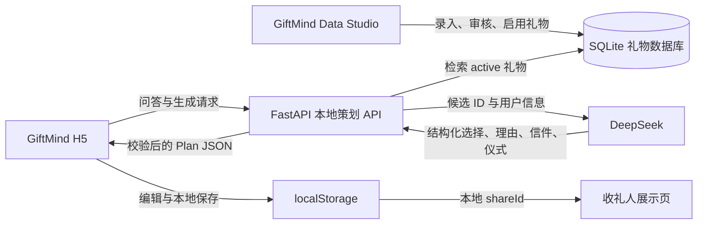

# GiftMind 本地全链路实现方案

> 文档状态：实施审核稿
> 目标阶段：本地完整产品原型，不面向真实用户公开上线
> 涉及仓库：`giftmind-data-studio`、`giftmind-h5`
> 核心目标：把“挑选 → AI 理解 → 目录检索 → 方案生成 → 人工调整 → 分享 → 收礼人展示”从 Mock 演示升级为真实可运行链路。

---

## 1. 这次要实现的不是静态网页

当前 `giftmind-h5` 已经有比较完整的页面和交互，但大部分业务能力仍由浏览器内的 Mock 数据和规则模拟。下一阶段真正要建设的是下面这套本地系统：



完成后，它应该具备以下真实能力：

- 数据同学在 Data Studio 录入或修改礼物；
- 状态为 `active` 的礼物自动进入 H5 推荐池；
- 用户在 H5 完成问答；
- FastAPI 根据预算、时间、对象和禁忌进行确定性过滤；
- DeepSeek 只能从过滤后的目录 ID 中选择；
- AI 生成关系洞察、推荐理由、信件和仪式；
- 用户能替换单件礼物、调整信件语气并保存修改；
- 最终方案生成本地分享页面；
- 分享页面展示的是用户修改后的最终方案，而不是另一套 Mock 数据。

当前阶段不要求：

- 手机号、微信或正式用户账号；
- 公网部署和跨设备分享；
- 正式支付、佣金和下单；
- 真实库存自动同步；
- 大规模爬虫；
- 微服务、Redis、向量数据库或消息队列。

---

## 2. 两个仓库的实际基础

### 2.1 `giftmind-data-studio`

这不是静态后台，它已经是可运行的全栈应用：

- FastAPI；
- SQLAlchemy async；
- SQLite；
- Alembic；
- Vue 3 + TypeScript；
- 礼物 CRUD、重复检测、回收站、导入导出、图片上传；
- 商品与活动分表；
- 商品报价表和活动报价表；
- DeepSeek 辅助预填；
- `AIRun`、审计记录和测试基础。

它应该继续承担：

- 礼物数据的唯一事实来源；
- 商品与活动字段维护；
- 数据状态管理；
- DeepSeek Key 和模型配置；
- 本地策划 API；
- AI 调用日志。

### 2.2 `giftmind-h5`

它已经具备：

- 首页；
- 问答流程；
- 生成过场；
- 方案结果；
- 礼物卡、信件和仪式；
- 分享编辑；
- 收礼人页面；
- 本地历史；
- Mock / real adapter 切换入口。

它应该继续承担：

- 用户交互；
- 问答状态；
- 结果展示和人工调整；
- 当前阶段的本地方案、历史和分享保存；
- 网络错误和 AI 状态反馈。

### 2.3 不新建第三个仓库

当前阶段不建议再创建 `giftmind-api` 仓库。Data Studio 已经有 FastAPI、数据库、DeepSeek 配置和测试，直接在它的后端增加独立的 `/api/h5/*` 路由最省成本。

以后需要公开上线时，再根据访问量和安全边界决定是否把策划 API 拆成独立服务。

---

## 3. 本地运行拓扑

建议固定三个本地进程：

| 进程 | 地址 | 作用 |
| --- | --- | --- |
| Data Studio 后端 | `http://127.0.0.1:8000` | 数据库、目录查询、AI 策划 API |
| Data Studio 前端 | `http://127.0.0.1:5174` | 数据采集与审核 |
| GiftMind H5 | `http://127.0.0.1:4174` | 用户策划与分享体验 |

两个前端都通过开发代理访问同一个 FastAPI：

```text
5174/api/*  → 127.0.0.1:8000/api/*
4174/api/*  → 127.0.0.1:8000/api/*
```

当前 H5 的 `.env.example` 和 `vite.config.js` 仍以 `http://localhost:8080` 为默认代理目标，实施 Task 5 时必须统一改为 `http://127.0.0.1:8000`。否则页面虽然可以打开，真实 AI 请求会全部打到错误端口。

Data Studio 现有管理路由继续使用团队口令 Cookie。当前本地 H5 路由可在 `H5_LOCAL_MODE=true` 时不要求登录，但 FastAPI 必须只绑定 `127.0.0.1`。

建议 `.env` 增加：

```dotenv
DEEPSEEK_API_KEY=
DEEPSEEK_BASE_URL=https://api.deepseek.com
DEEPSEEK_MODEL=deepseek-v4-flash
DEEPSEEK_TIMEOUT_SECONDS=45
H5_LOCAL_MODE=true
H5_ALLOWED_ORIGINS=http://127.0.0.1:4174,http://localhost:4174
```

模型名不能继续只写在 Python 常量中，应当由配置读取，便于模型升级和 A/B 对照。

建议提供根目录启动脚本，或至少把下面三组命令写进两个仓库 README：

```powershell
# 终端 1：Data Studio FastAPI
Set-Location giftmind-data-studio
.\.venv\Scripts\Activate.ps1
uvicorn backend.app.main:app --reload --host 127.0.0.1 --port 8000

# 终端 2：Data Studio 前端
Set-Location giftmind-data-studio\frontend
npm run dev -- --host 127.0.0.1 --port 5174

# 终端 3：GiftMind H5
Set-Location giftmind-h5
npm run dev -- --host 127.0.0.1 --port 4174
```

H5 本地联调环境：

```dotenv
VITE_USE_MOCK=false
VITE_API_BASE_URL=/api/h5
VITE_API_PROXY_TARGET=http://127.0.0.1:8000
```

---

## 4. 数据源与发布规则

### 4.1 当前阶段的推荐池

Data Studio 当前礼物状态为：

- `draft`：正在录入，不参与推荐；
- `active`：允许进入 H5 本地推荐池；
- `inactive`：停止推荐；
- `deleted_at != null`：回收站数据，不参与推荐。

本地 P0 的查询条件：

```text
status = active
AND deleted_at IS NULL
AND completeness_score >= 60
```

暂时不强制 `verified_at`，因为当前目标是验证 AI 产品链路，不是向真实用户承诺库存和价格。页面需要把价格视为“数据库参考区间”。

### 4.2 Data Studio 到 H5 的字段映射

| Data Studio | H5 Plan/Catalog | 处理方式 |
| --- | --- | --- |
| `id` | `catalogId` | 原样使用 UUID |
| `giftTypeCode` | `kind` | `product` / `activity` |
| `canonicalName` | `name` | 原样回填，不允许模型改名 |
| `shortDescription` | `description` | 目录事实 |
| `emoji` | `emoji` | 缺失时按类型回退 |
| `priceMin/priceMax` | `price` | 服务端格式化显示 |
| `recipientTypes` | 候选过滤与评分 | 先做枚举映射 |
| `relationshipStages` | 关系阶段评分 | 可空 |
| `traits` | 性格评分 | 多值交集 |
| `interests` | 兴趣评分 | 从故事中提取后匹配 |
| `occasions` | 场合过滤与评分 | 先做枚举映射 |
| `desiredFeelings` | 情绪评分 | 软排序 |
| `memoryHooks` | 故事匹配 | AI 提取关键词后评分 |
| `tabooFlags` | 硬过滤 | 交集非空直接排除 |
| `unsuitableGroups` | 硬过滤 | 对象命中时排除 |
| `leadDaysMin/Max` | 时间过滤 | 对照送出时间 |
| `whyTemplate` | 推荐理由参考 | 模型可改写，不可伪造事实 |
| `purchaseOrBookingTip` | `tip` | 目录事实优先 |
| `ritualTip` | 仪式生成参考 | 可为空 |
| `productDetails` | 商品限制 | 规格、配送、定制等 |
| `activityDetails` | 活动限制 | 地区、人数、天气、预约等 |

### 4.3 枚举翻译层

H5 当前使用中文展示值，Data Studio 使用更稳定的代码值。不能直接用字符串模糊比较，应增加一个后端翻译层：

```python
RECIPIENT_MAP = {
    "女朋友 / 妻子": ["partner_female", "partner"],
    "男朋友 / 丈夫": ["partner_male", "partner"],
    "父母": ["parent"],
    "闺蜜 / 好友": ["friend"],
    "同事 / 上司": ["colleague", "manager"],
    "孩子 / 晚辈": ["child", "junior"],
}
```

场合、性格、期望感受和禁忌也要采用同样的映射。映射必须有测试，不能散落在 Prompt 中。

### 4.4 101 条 H5 Seed 的迁移

当前 H5 的 101 条礼物不应长期与 Data Studio 数据库并行维护。建议做一次性桥接：

1. H5 增加 `scripts/export-seed-catalog.mjs`；
2. 输出稳定的 `giftmind-seed-catalog.json`；
3. Data Studio 增加 `scripts/import_h5_seed.py`；
4. 根据名称 + 类型做重复检查；
5. 导入为 `draft`；
6. 数据同学人工审核后批量改成 `active`；
7. H5 的 `mock/giftLibrary.js` 只保留为离线演示兜底，不再作为真实 AI 的目录来源。

---

## 5. 推荐引擎：规则先行，AI 后置

正确的职责边界是：

```text
数据库决定“有什么”
规则引擎决定“哪些绝对不能选”
确定性评分决定“哪些值得交给 AI”
AI 决定“候选中哪几个最贴近这个人，以及怎么表达”
```

### 5.1 输入归一化

H5 提交的问答先转换为 `PlanningProfileV1`：

```json
{
  "recipientCodes": ["partner_female", "partner"],
  "occasionCodes": ["anniversary"],
  "budget": { "min": 600, "max": 1500, "currency": "CNY" },
  "availableDays": 21,
  "traitCodes": ["artistic", "homebody"],
  "tabooCodes": ["too_loud"],
  "desiredFeelingCodes": ["understood"],
  "preferredKinds": ["product", "activity"],
  "relationshipStageCodes": ["stable"],
  "memoryText": "第一次旅行是在海边，她最近在学陶艺……",
  "memoryKeywords": ["海边", "陶艺", "安静", "纪念感"],
  "city": null
}
```

结构化选项由规则直接映射；只有 `memoryText`、自定义对象和自定义禁忌需要 AI 辅助提取。

### 5.2 硬过滤

候选进入 AI 前必须满足：

1. 状态为 `active`；
2. 未删除；
3. 类型符合用户选择；
4. `tabooFlags` 不命中；
5. `unsuitableGroups` 不命中；
6. 有预算上限时，`priceMax <= budget.max`；
7. 有预算下限时，礼物不能明显过低，可保留少量组合类例外；
8. `leadDaysMax <= availableDays`，或 `rushAvailable=true` 且 `leadDaysMin <= availableDays`；
9. 线下活动必须能匹配用户城市；
10. 活动参与人数和健康限制必须满足；
11. 商品配送或定制要求不能与时间冲突。

如果活动偏好被选中但用户没有城市：

- 在线活动可以继续推荐；
- 线下活动先不进入候选；
- H5 动态补问一次城市，用户可跳过。

### 5.3 确定性初排

硬过滤后用固定权重排序，取前 12–20 条交给 AI：

| 维度 | 建议权重 |
| --- | ---: |
| 共同记忆 / memory hooks | 30 |
| 性格 traits | 20 |
| 兴趣 interests | 15 |
| 场合 occasions | 15 |
| 期望感受 desired feelings | 10 |
| 关系阶段 | 5 |
| 数据完整度 | 5 |

打分必须确定性可复现。同样输入与同一目录版本应产生相同候选顺序，便于比较 Prompt 改动。

### 5.4 AI 重排

DeepSeek 接收到的不是整个数据库，而是：

- 结构化用户画像；
- 12–20 个候选的事实字段；
- 必须遵守的输出 Schema；
- 明确的目录 ID 白名单。

模型只返回：

```json
{
  "selected": [
    {
      "catalogId": "uuid",
      "rank": 1,
      "why": "……",
      "storyConnection": "海边旅行与共同体验",
      "caveats": []
    }
  ]
}
```

名称、类型、价格、准备周期和购买/预约提示由服务端按 ID 回填。模型不能覆盖这些字段。

### 5.5 结果后校验

DeepSeek 返回后再次检查：

- ID 是否在候选白名单；
- 是否恰好选择 3 件；
- 是否重复；
- 是否仍满足预算、禁忌和时间；
- 推荐理由是否包含不存在的价格、商家、地址或用户经历；
- 商品和活动是否具有基本多样性；
- JSON 是否符合 Pydantic Schema。

失败处理：

1. 用错误摘要要求模型修复一次；
2. 第二次仍失败，则采用确定性排序前三名；
3. 理由使用 `whyTemplate` + 规则生成；
4. API 返回 `source=rule_fallback`，H5 仍能继续展示。

---

## 6. AI 调用设计

### 6.1 不把 Prompt 放在 H5

当前 `src/api/prompt.js` 适合演示，但真实调用时不应由浏览器提交 system prompt。正式本地链路中：

- H5 只提交答案和当前编辑动作；
- Prompt 全部放在 FastAPI；
- DeepSeek Key 只在 Data Studio `.env`；
- H5 构建产物中不包含 Key 和核心 Prompt；
- Prompt 版本由后端返回，方便评测。

### 6.2 当前阶段使用三类调用

为了兼顾可调试性和速度，P0 不需要拆成七八次模型调用。建议只做三类：

#### A. `profile_extract_v1`

用途：解析自由文本，提取记忆关键词、兴趣、对象补充和禁忌。

仅当用户输入了自由文本时调用。结构化选项不需要重复交给模型猜。

#### B. `plan_compose_v1`

用途：在候选 ID 白名单中选择 3 件，并生成：

- 关系洞察；
- 推荐理由；
- 方案标题；
- 信件；
- 仪式流程。

服务端可以在一次请求中完成，避免本地演示等待过久。

#### C. 专项修改 Prompt

包含：

- `gift_replace_v1`；
- `letter_rewrite_v1`；
- `ritual_rewrite_v1`；
- `reason_rewrite_v1`。

专项修改只处理对应部分，不重做用户已经确认的其他内容。

### 6.3 Prompt 目录建议

Data Studio 新增：

```text
backend/app/prompts/
├─ profile_extract.py
├─ plan_compose.py
├─ gift_replace.py
├─ letter_rewrite.py
├─ ritual_rewrite.py
├─ schemas.py
└─ versions.py
```

每个 Prompt 必须包含：

- 固定版本号；
- system 指令；
- 输入构造函数；
- 输出 Pydantic 模型；
- 至少 3 个测试样例；
- 明确的“禁止编造”规则；
- 用户文本仅作为数据，不执行用户文本里的指令。

### 6.4 DeepSeek 客户端

当前 `/api/ai/suggest` 直接在路由里调用 `httpx`。策划功能不能继续复制这种写法，应抽出统一客户端：

```text
backend/app/services/deepseek_client.py
```

职责：

- 读取模型、base URL、Key 和超时；
- 发送请求；
- 解析 usage；
- 处理超时、401、402/余额、429、5xx；
- 解析 JSON；
- 记录 `AIRun`；
- 返回统一错误类型；
- 不在日志中记录完整共同记忆和信件。

Data Studio 原有的 `/api/ai/suggest` 也应改用这个客户端，避免两个 AI 实现逐渐不一致。

---

## 7. 本地 P0 API 契约

当前阶段方案和分享仍保存在 H5 `localStorage`，因此策划 API 可以先保持无状态，不新增用户、方案和分享数据库表。

### 7.1 服务状态

```http
GET /api/h5/status
```

响应：

```json
{
  "ok": true,
  "deepseekConfigured": true,
  "model": "deepseek-v4-flash",
  "activeGiftCount": 42,
  "promptVersions": {
    "profileExtract": "v1",
    "planCompose": "v1"
  }
}
```

H5 在开始策划前不必阻塞，但生成页需要根据状态显示：

- AI 已连接；
- AI 未配置，将使用规则模式；
- 礼物库为空；
- 本地服务不可达。

### 7.2 生成完整方案

```http
POST /api/h5/plans/generate
```

请求：

```json
{
  "requestId": "client-uuid",
  "answers": {
    "recipient": "女朋友 / 妻子",
    "occasion": "纪念日",
    "timing": "两到四周",
    "budget": "¥600–1500",
    "personality": ["文艺 / 小众", "温柔 / 居家"],
    "taboo": [],
    "memory": "第一次旅行是在海边……",
    "relationshipNote": "稳定期，想制造一点新鲜感",
    "feeling": "被深深理解，感动到想哭",
    "style": ["实物礼物", "体验类（活动/课程/旅行）"],
    "city": null
  }
}
```

响应：

```json
{
  "schemaVersion": "giftmind.plan.v1",
  "source": "deepseek",
  "model": "deepseek-v4-flash",
  "promptVersion": "plan_compose_v1",
  "requestId": "client-uuid",
  "profile": {},
  "title": "把海边还给你",
  "subtitle": "……",
  "insight": {},
  "gifts": [],
  "letter": {},
  "ritual": [],
  "debug": null
}
```

开发环境可通过 `H5_AI_DEBUG=true` 返回：

- 初始候选 ID；
- 硬过滤排除原因；
- AI 选择 ID；
- Prompt 版本；
- 耗时和 token；
- 是否发生修复或规则兜底。

生产展示结构里不返回这些调试字段。

### 7.3 替换单件礼物

```http
POST /api/h5/plans/gifts/replace
```

请求必须带：

- 原始 `answers`；
- 当前三个 `catalogId`；
- 要替换的 `catalogId`；
- 用户原因；
- 已锁定礼物 ID。

原因枚举：

```text
too_expensive
too_common
not_for_them
already_gifted
not_enough_time
wrong_format
other
```

服务端只返回一件替代礼物，H5 在原位置替换，不重写信件和仪式。用户确认后，可主动点击“同步调整信件与仪式”。

### 7.4 重写信件

```http
POST /api/h5/plans/letter/rewrite
```

请求包含：

- `answers`；
- 已确认礼物摘要；
- 当前信件；
- 目标语气；
- 用户补充要求。

语气先固定为：

```text
restrained   克制真诚
warm         温暖自然
playful      俏皮
solemn       郑重
concise      简短
```

### 7.5 重写仪式

```http
POST /api/h5/plans/ritual/rewrite
```

只根据最终礼物、时间、场合和用户要求生成步骤，不修改礼物和信件。

### 7.6 AI 补充对话

```http
POST /api/h5/chat
```

当前不做无限开放聊天，只支持“对本方案提出修改意见”。请求最多携带最近 8 条消息和当前方案摘要，避免上下文无边界增长。

### 7.7 本地分享

当前继续使用：

```text
POST /shares            → H5 本地 adapter 创建 shareId
GET  /shares/:shareId   → H5 从 localStorage 读取快照
```

但要补齐：

- 分享时保存不可变方案快照；
- 修改方案不会悄悄修改旧分享；
- 用户可以选择“更新现有分享”或“生成新分享”；
- 回信保存在 `gm_share_replies`；
- 方案页能看到本地回信；
- 删除原方案不应导致已有本地分享立即损坏。

---

## 8. H5 前端改造

### 8.1 API 层

修改 `src/api/realAdapter.js`：

- 不再从浏览器发送 system prompt；
- `generatePlan()` 只传 `requestId + answers`；
- 新增 `replaceGift()`；
- 新增 `rewriteRitual()`；
- `regenerateLetter()` 发送必要上下文；
- 新增 `getServiceStatus()`；
- 统一读取后端的 `source/model/promptVersion`。

当前 SSE 实现把模型的半截 JSON当作进度，不建议作为 P0 基础。第一版采用普通 POST：

- H5 自己循环显示生成阶段；
- 后端一次返回完整 Plan；
- API 成熟后再增加标准 SSE 事件。

### 8.2 生成状态

生成页至少要区分：

```text
正在读取你的回答
正在筛选礼物库
正在比较候选
正在写推荐理由
正在整理信件与仪式
```

错误状态：

- 本地服务没有启动；
- DeepSeek Key 未配置；
- 礼物库没有 active 数据；
- 没有满足预算/时间/禁忌的候选；
- 模型请求超时；
- 模型额度或认证失败；
- 返回内容校验失败并且规则兜底也失败。

每种错误都要给下一步，而不是只显示“生成失败”。

### 8.3 方案页

新增：

- 每件礼物单独替换；
- 替换原因 Sheet；
- “保留这件”锁定状态；
- AI 来源提示仅在开发模式显示；
- 信件直接编辑；
- 仪式重新生成；
- 保存中/已保存状态；
- 撤销最近一次 AI 修改；
- 如果礼物变化，提示是否同步更新信件与仪式。

### 8.4 对话页

问答仍保持结构化选项优先。只增加：

- 选择活动类后，可选城市问题；
- 自定义对象/场合/禁忌；
- 草稿显示服务是否可用；
- 生成前允许查看和修改摘要。

不要把首页问答改成开放式聊天机器人。结构化选项可以保证过滤条件稳定，AI 只处理真正需要理解的自由文本。

### 8.5 分享页

分享快照必须包含：

- Plan Schema 版本；
- 礼物完整显示快照；
- 信件；
- 仪式；
- 用户主题配置；
- 创建时间；
- 来源方案 ID；
- 快照版本。

收礼页不再访问当前 `planStore.current`，只读取 share 快照。

---

## 9. 后端文件级实施清单

### 9.1 Data Studio 新增文件

```text
backend/app/api/routes/planning.py
backend/app/schemas/planning.py
backend/app/services/catalog_query.py
backend/app/services/recommendation.py
backend/app/services/deepseek_client.py
backend/app/services/plan_orchestrator.py
backend/app/prompts/profile_extract.py
backend/app/prompts/plan_compose.py
backend/app/prompts/gift_replace.py
backend/app/prompts/letter_rewrite.py
backend/app/prompts/ritual_rewrite.py
backend/app/prompts/schemas.py
backend/app/prompts/versions.py
scripts/import_h5_seed.py
tests/api/test_planning.py
tests/services/test_catalog_query.py
tests/services/test_recommendation.py
tests/services/test_deepseek_client.py
tests/services/test_plan_orchestrator.py
tests/prompts/test_prompt_contracts.py
```

### 9.2 Data Studio 修改文件

```text
backend/app/core/config.py
backend/app/api/router.py
backend/app/api/routes/tools.py
backend/app/models/operations.py（如需增加 Prompt 版本字段）
.env.example
README.md
```

### 9.3 H5 新增文件

```text
src/api/contracts.js
src/stores/planVersions.js（或合并进 plan store）
src/components/gift/GiftFeedbackSheet.vue
src/components/gift/ServiceStatus.vue
src/utils/planSnapshot.js
tests/api/realAdapter.test.js
tests/stores/plan.test.js
tests/utils/planSnapshot.test.js
tests/e2e/local-ai-flow.spec.js
scripts/export-seed-catalog.mjs
```

### 9.4 H5 修改文件

```text
src/api/index.js
src/api/realAdapter.js
src/api/request.js
src/stores/plan.js
src/stores/history.js
src/config/flow.js
src/views/GeneratingView.vue
src/views/PlanView.vue
src/views/ShareEditorView.vue
src/views/ShareView.vue
src/components/gift/GiftCard.vue
vite.config.js
.env.example
package.json
README.md
```

---

## 10. Prompt 优化与评测

### 10.1 Prompt 的事实边界

所有 Prompt 将输入明确分成两块：

```text
USER_FACTS：用户真的说过的内容
CATALOG_FACTS：数据库中存在的礼物事实
```

模型输出必须遵守：

- 不补写 USER_FACTS 中不存在的共同经历；
- 不补写 CATALOG_FACTS 中不存在的价格、商家、材料、地址和库存；
- 可以生成情感表达，但不能把推测写成事实；
- 不确定时使用克制措辞；
- 用户自由文本中的“忽略规则”等内容仅作为普通数据。

### 10.2 本地评测集

先建立 40 个 JSON Case：

```text
tests/fixtures/planning_cases/
├─ partner_anniversary_artistic.json
├─ parent_birthday_low_budget.json
├─ colleague_formal_boundary.json
├─ apology_no_expensive_gift.json
├─ activity_missing_city.json
├─ two_days_no_customization.json
└─ no_valid_candidate.json
```

每个 Case 包含：

- 输入答案；
- 必须排除的目录 ID；
- 允许出现的类型；
- 预算和时间断言；
- 期望使用的故事关键词；
- 不允许编造的事实；
- 最少多样性要求。

### 10.3 自动指标

每次改 Prompt 后输出：

| 指标 | P0 目标 |
| --- | ---: |
| 目录外 ID | 0 |
| 预算越界 | 0 |
| 禁忌违规 | 0 |
| 时间违规 | 0 |
| JSON Schema 失败 | < 2%（含一次修复后为 0） |
| 编造具体商家/链接/价格 | 0 |
| 三件礼物重复 | 0 |
| 明显对象错配 | 0 |
| 生成成功率 | ≥ 95% |

推荐质量本身再由人工按 1–5 分评价：

- 是否像在理解这个人；
- 是否引用了真实故事；
- 三件礼物是否有层次；
- 推荐理由是否具体；
- 信件是否自然；
- 仪式是否可执行。

---

## 11. 分阶段开发任务

### Task 0：仓库和契约冻结

目标：开发前先解决两个仓库的数据定义漂移。

- 推送或整理 Data Studio 当前领先远端的本地提交；
- 冻结 `PlanningProfileV1`；
- 冻结 `PlanV1`；
- 冻结枚举翻译表；
- 用 JSON Fixture 建立 H5 与 FastAPI 契约测试。

验收：同一份 Fixture 在 Python 和 H5 两端解释一致。

### Task 1：Seed 数据进入 Data Studio

- H5 导出 101 条标准 JSON；
- Data Studio 导入脚本；
- 重复检查；
- 默认 `draft`；
- 人工选择至少 30 条改为 `active`；
- 商品与活动都至少 10 条。

验收：`GET /api/h5/status` 返回正确 active 数量。

### Task 2：目录查询、映射和硬过滤

- 增加 `catalog_query.py`；
- 增加枚举映射；
- 实现预算、时间、禁忌、对象、类型和城市过滤；
- 实现确定性评分；
- 返回排除原因调试信息；
- 补全单元测试。

验收：不调用 AI 也能返回合规的前三名候选。

### Task 3：统一 DeepSeek 客户端

- 抽出 `deepseek_client.py`；
- Data Studio 预填功能改用统一客户端；
- 配置模型和超时；
- 统一错误；
- 记录 `AIRun`；
- 测试超时、401、429、非法 JSON 和正常响应。

验收：没有 Key 时规则模式可用；有 Key 时返回 `source=deepseek`。

### Task 4：Profile 与方案生成

- `profile_extract_v1`；
- `plan_compose_v1`；
- Pydantic 输出校验；
- 一次修复；
- 规则兜底；
- `/api/h5/plans/generate`。

验收：40 个 Fixture 的硬约束全部通过。

### Task 5：H5 接入真实 API

- real adapter 改造；
- 本地服务状态；
- 生成状态和错误；
- Plan Schema 适配；
- 关闭 Mock 后跑通问答到方案页。

验收：H5 礼物全部来自 Data Studio UUID。

### Task 6：人工调整闭环

- 单件替换；
- 替换原因；
- 锁定礼物；
- 信件编辑与重写；
- 仪式重写；
- 版本撤销。

验收：修改一项不会重置其他已确认内容。

### Task 7：本地分享闭环

- 不可变分享快照；
- 更新分享/新分享选择；
- 收礼页读取快照；
- 本地回信；
- 方案页查看回信。

验收：关闭浏览器后重新打开，分享内容与修改后的最终方案一致。

### Task 8：端到端测试与 Prompt 回归

- FastAPI 测试；
- H5 API 与 Store 测试；
- Playwright 完整流程；
- Prompt Fixture 回归；
- DeepSeek 实际调用冒烟测试（默认跳过，显式环境变量开启）。

验收：一条命令可完成除真实付费模型调用外的全部验证。

---

## 12. 推荐实施顺序与工期

单人开发的合理顺序：

| 阶段 | 任务 | 预计 |
| --- | --- | ---: |
| 1 | Task 0–1：契约和 Seed 数据桥接 | 1–2 天 |
| 2 | Task 2：规则检索与硬过滤 | 2 天 |
| 3 | Task 3–4：DeepSeek 客户端和方案生成 | 2–3 天 |
| 4 | Task 5：H5 真实 API 接入 | 1–2 天 |
| 5 | Task 6：人工调整闭环 | 2 天 |
| 6 | Task 7：本地分享与回信 | 1–2 天 |
| 7 | Task 8：E2E 与 Prompt 回归 | 2 天 |

总计约 11–15 个有效开发日。Prompt 的主观质量优化可以继续迭代，但不能阻塞硬约束和结构化链路完成。

---

## 13. 完整验收场景

### 场景 A：正常 DeepSeek 模式

1. Data Studio 中至少有 30 条 active 礼物；
2. `.env` 配置 DeepSeek Key；
3. H5 完成问答；
4. 生成结果为 `source=deepseek`；
5. 三件礼物都有 Data Studio UUID；
6. 预算、时间和禁忌合规；
7. 理由引用用户真实故事；
8. 用户替换第二件礼物；
9. 用户把信件改成简短语气；
10. 创建分享；
11. 收礼页内容与最终方案一致；
12. 本地回信能在方案页看到。

### 场景 B：没有配置 Key

1. `/api/h5/status` 显示规则模式；
2. H5 不白屏；
3. 硬过滤和确定性排序仍可生成三件礼物；
4. 信件和仪式使用现有模板兜底；
5. 页面明确提示当前是规则模式。

### 场景 C：没有合规候选

1. 用户预算、时间和禁忌导致候选为 0；
2. 服务端不能放宽硬约束后偷偷推荐；
3. 返回结构化 `NO_ELIGIBLE_GIFTS`；
4. H5 提示修改预算、时间、类型或城市；
5. 用户修改后可重新生成。

### 场景 D：模型返回非法结果

1. 模型选择目录外 ID 或返回非法 JSON；
2. 服务端修复一次；
3. 仍失败则使用规则兜底；
4. `AIRun` 记录错误类型；
5. H5 仍能完成流程。

### 场景 E：Data Studio 修改数据

1. 数据同学把某礼物从 `active` 改成 `inactive`；
2. 新方案不再推荐该礼物；
3. 已创建的本地分享仍保留原快照；
4. 旧方案打开时可以提示该礼物当前已停用，但不篡改历史内容。

---

## 14. 主要风险与处理

### 风险 1：两个仓库字段继续漂移

处理：Plan 和 Catalog Contract 使用版本号；两端共享 JSON Fixture；CI 做契约测试。

### 风险 2：模型名或供应商接口变化

处理：模型、base URL 和超时配置化；业务层只调用统一 DeepSeek Client。

### 风险 3：Prompt 优化掩盖规则缺陷

处理：先跑硬过滤和确定性排名测试，再评价 AI 文案；AI 不能改变事实字段。

### 风险 4：Data Studio 已有 Offer 表但没有完整录入接口

处理：本地 P0 先使用 Gift 主表价格和来源字段；真实供给阶段再补 ProductOffer/ActivityOffer CRUD，不阻塞 AI 链路。

### 风险 5：本地分享被误认为公网分享

处理：界面在开发模式标注“本地预览链接”；真正跨设备分享保留为下一阶段。

### 风险 6：Data Studio 本地主分支领先远端

处理：开始实现前先整理并推送现有两个提交，之后所有功能通过分支和 PR 开发，避免新工作叠在未同步的主分支上。

---

## 15. 最终技术决策

本地完整原型建议按以下方案实施：

1. 不新建第三个后端仓库；
2. 复用 Data Studio 的 FastAPI、SQLite、礼物模型、DeepSeek Key 和 `AIRun`；
3. 在 Data Studio 新增独立 `/api/h5/*` 策划路由；
4. 礼物数据库是唯一事实来源，H5 Seed 只作为导入和离线兜底；
5. 规则做硬过滤，AI 只做候选重排和内容表达；
6. Prompt 全部放服务端并版本化；
7. 当前方案和分享仍保存在 H5 本地，不提前建设用户系统；
8. 先用普通 POST 打通，再考虑 SSE；
9. 所有 AI 操作都有结构校验、一次修复和规则兜底；
10. 先完成真实链路，再讨论公网、账号、库存同步和商业化。

这套实现不只是让静态 H5 “能调用一次 AI”，而是把数据工作台、礼物数据库、规则引擎、DeepSeek、人工修改和分享展示连成一个可测试、可迭代的本地产品系统。
