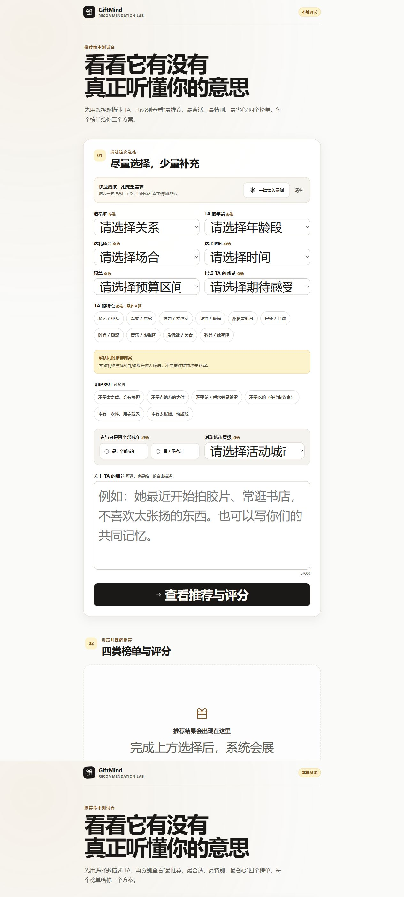
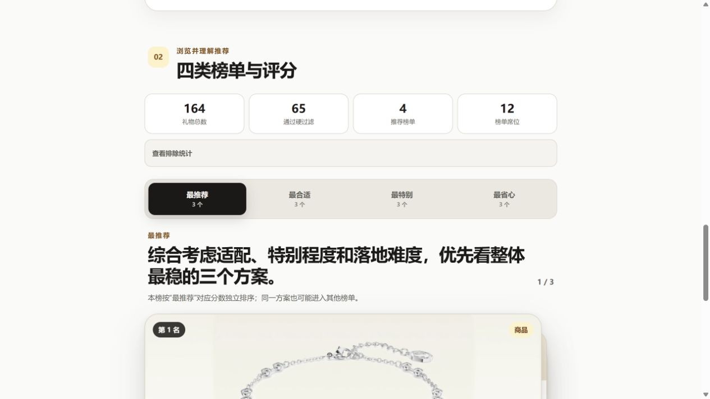
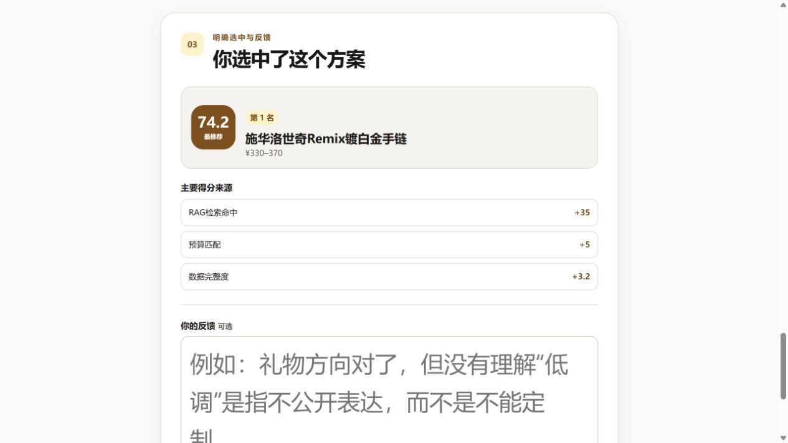
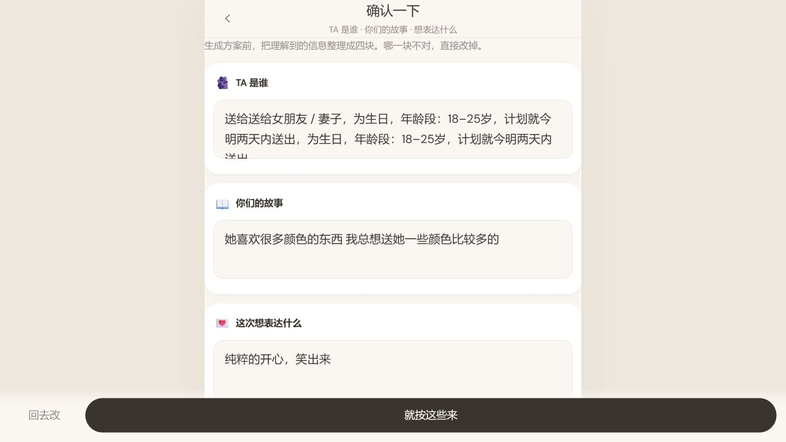

# GiftMind 核心推荐体验审计

日期：2026-08-08  
范围：H5 首页 → AI 理解确认 → 生成方案，以及 Recommendation Lab 的填写 → 四类榜单 → 选中反馈。

## 总体判断

视觉方向已经形成，推荐测试台的字段语义和可访问性基础也不错。当前最大问题不是“页面不够漂亮”，而是关键链路里的信任和容错：输入较重、确认摘要重复、分数解释偏技术、无候选时形成死路。

城市层级暂时保留为内部实验字段，不作为当前体验定稿项，也不建议继续暴露“一线/二线/三线”这种内部语言给普通用户。

## 流程步骤

### Step 1：进入 GiftMind 首页 — 健康度：中

- 优点：品牌气质明确，价值主张比普通“礼物推荐器”更有情绪价值。
- 风险：首页同时出现继续、重新开始、开始策划三个入口；“聊十分钟”会制造较高承诺门槛。
- 风险：项目尚未上线，不应使用“每天都有人……”和虚构用户证言作为信任依据。
- 适配风险：桌面宽度下移动容器和文字发生裁切，固定操作栏也可能越过内容边界。

### Step 2：填写推荐测试表 — 健康度：中

- 优点：必选/可选清楚，控件有语义标签；年龄、预算、时间和禁忌作为硬条件是合理的。
- 风险：首屏需要处理太多字段，与首页“AI 顺着回答往下问”的承诺冲突。
- 风险：成年确认和活动城市层级无论用户是否需要活动都强制出现，增加无效思考。
- 建议：生产 H5 改为一屏一个关键问题，剩余问题按回答动态出现；测试台可继续保留完整表单。

### Step 3：查看四类推荐榜单 — 健康度：中上

- 优点：四个榜单边界清楚，卡片堆叠和下一张操作能表达“继续挑选”。
- 风险：164、65、4、12 属于内部调试指标，普通用户并不需要。
- 风险：四类各三个方案意味着最多 12 个席位，容易再次进入“选择过载”。
- 风险：第一名综合 74.2，但适配度只有 40.2；如果不先解释这种反差，用户会怀疑推荐质量。
- 建议：默认每类先露出一个冠军方案；用户点进某类后再看余下两个。

### Step 4：选中并反馈 — 健康度：中

- 优点：明确记录“选中”而不是把浏览误当偏好，这个产品判断是正确的。
- 风险：“RAG 检索命中、数据完整度”是工程语言，不是送礼理由。
- 风险：选中后只有提交反馈，没有明显进入写信、送出计划、购买/预约或分享的下一步。
- 建议：主按钮改成“选它，继续生成送出方案”；技术评分折叠到“查看推荐依据”。

### Step 5：AI 理解确认 — 健康度：差

- 已确认缺陷：“送给送给女朋友”、生日/年龄/时间重复出现，预算与约束也重复拼接。
- 风险：这是 AI 生成前最重要的信任检查，一旦出现重复，用户会立即怀疑系统没有听懂。
- 建议：摘要由结构化字段单次渲染，不再把旧摘要重新拼回新摘要；每块提供短句编辑，不用大文本框承载机器拼接文本。

### Step 6：无候选状态 — 健康度：差

- 已确认缺陷：界面显示有 164 件候选，但最终却提示没有任何可用候选。
- 风险：“放宽一个条件”没有告诉用户究竟是哪条条件清空了候选；“再试一次”大概率得到同样结果。
- 风险：显示 `deepseek-v4-flash 已连接` 对用户没有帮助，反而暴露技术实现。
- 建议：后端计算反事实候选数，并提供一键恢复按钮，例如“把送出时间放宽到一周（+8 个）”“同时看看体验（+12 个）”。永远不要让用户自己猜。

## 优先级建议

### P0：先让主链路永远走得通

1. 修复确认摘要重复。
2. 无候选时明确是哪条条件造成，并给出带候选数量的一键放宽。
3. 选中后接上“写信 → 送出计划 → 保存/分享”，而不是停在反馈表。
4. 将技术评分翻译为用户语言：为什么适合、可能踩雷、为什么现在能执行。

### P1：减少回答和选择负担

1. 生产 H5 使用渐进式对话，每次只问一个关键问题，并显示“还剩 3 个关键问题”。
2. 仅当高风险活动进入候选时确认参与者是否成年；年龄安全过滤仍在后端强制执行。
3. 四类榜单各保留三个，但首页每类先展示一个冠军，再按需展开另外两个。
4. 支持“收藏两个比较”，避免用户必须立即二选一。

### P2：再提高真实感和长期信任

1. 展示价格更新时间、来源和是否需要二次确认。
2. 对活动展示“本地是否已验证”；未验证时明确写成灵感方案。
3. 用真实测试反馈替换虚构社会证明；上线前可直接标注“内测版”。
4. 完成移动端安全区、键盘遮挡、缩放、对比度和键盘焦点检查。

## 城市信息的暂定处理

- 数据库继续保留城市层级标签，方便内部供给筛选和后续分析。
- 当前不再扩大或锁死“一线/二线/三线”的划分。
- 用户侧更自然的提问是“你在哪座城市？”或“是否接受线上/跨城活动？”。
- 最好在体验礼物进入前三名后再询问具体城市；后台再把城市映射为层级并检查供给。

## 证据边界

本次审计基于本地桌面浏览器的可见流程和语义结构。尚未完成真机触控、软键盘、安全区、屏幕阅读器和弱网测试，因此不能据此宣称达到完整无障碍标准。
